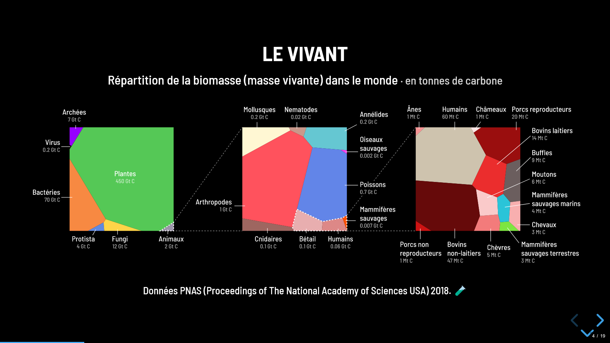
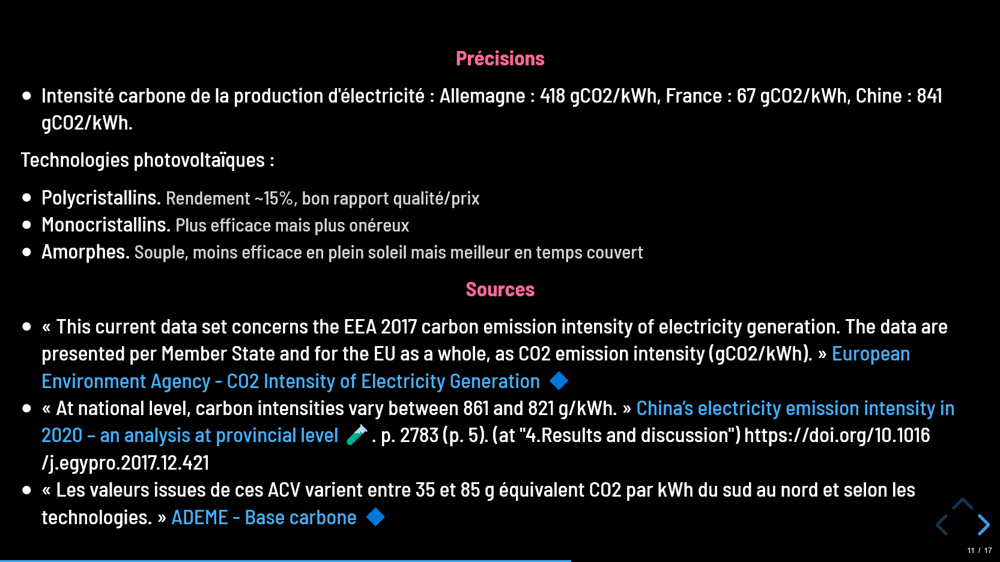
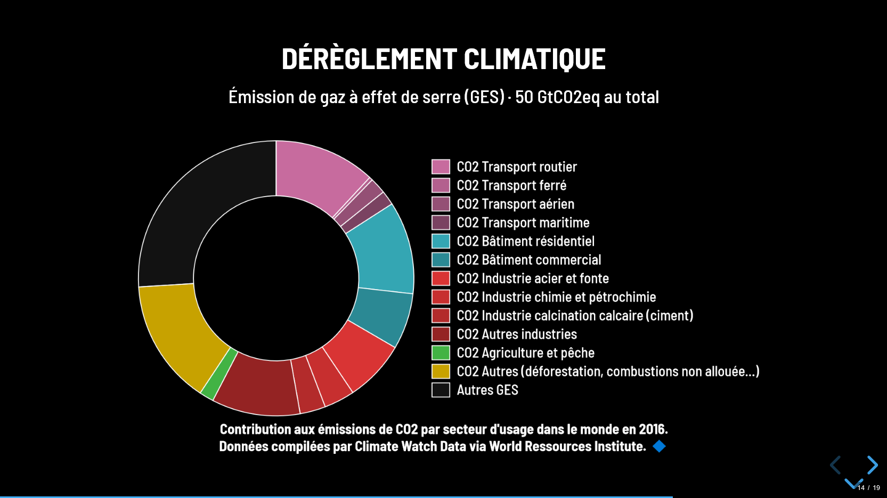
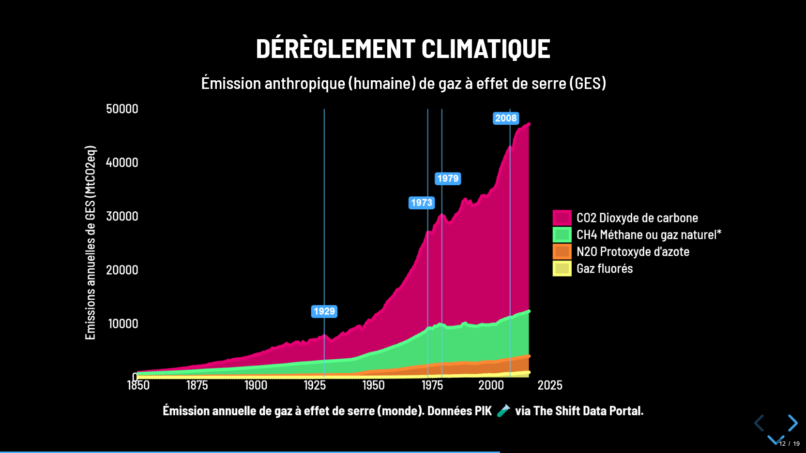
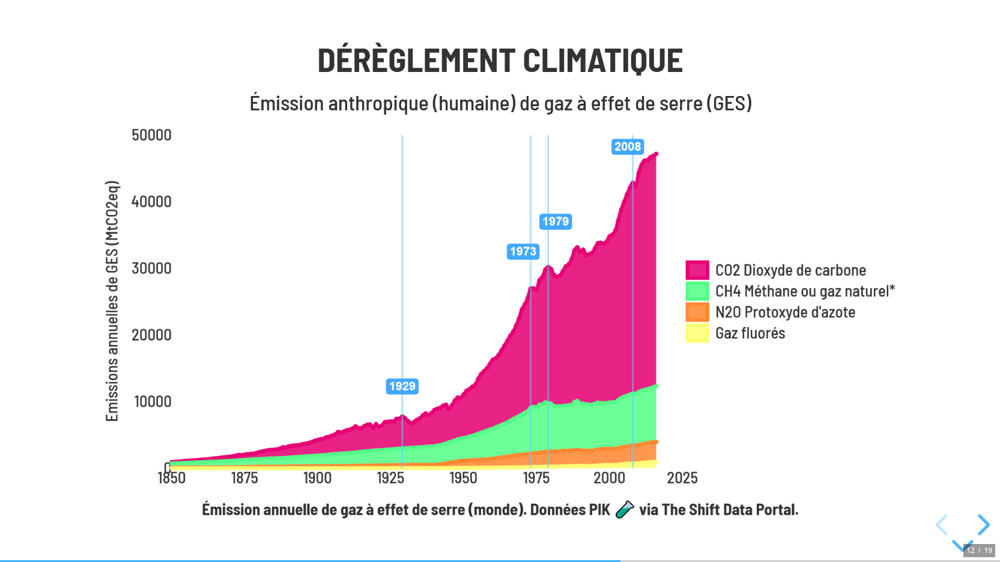
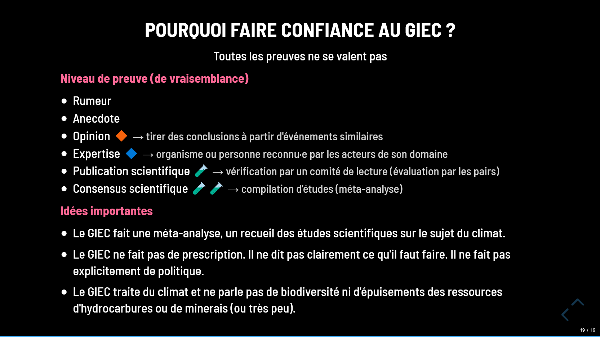
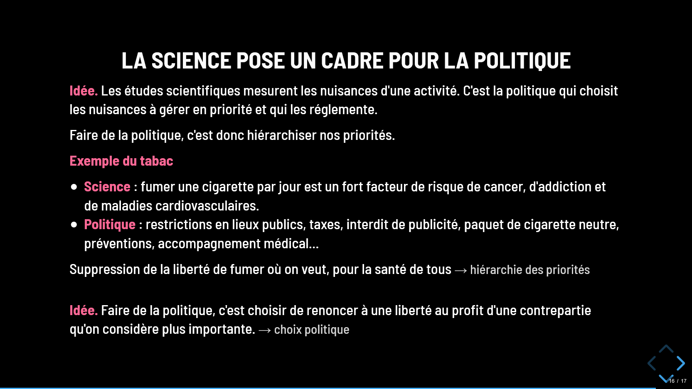
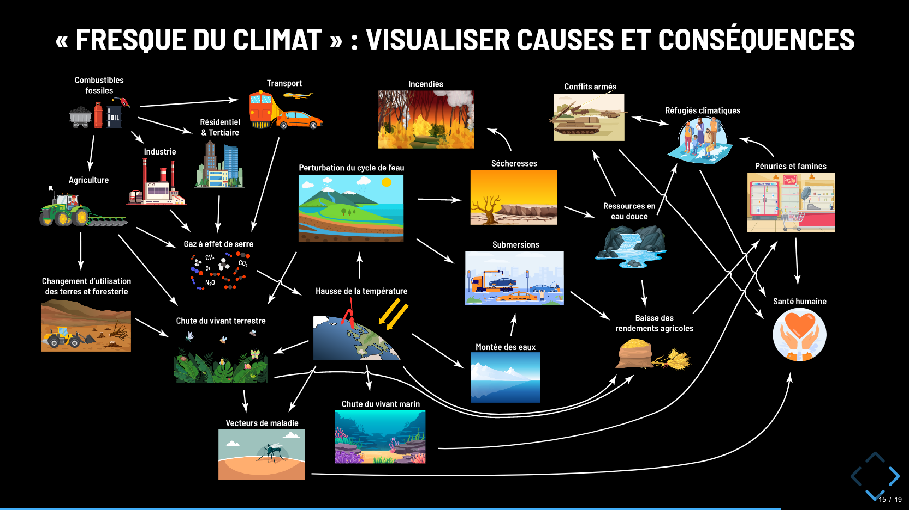
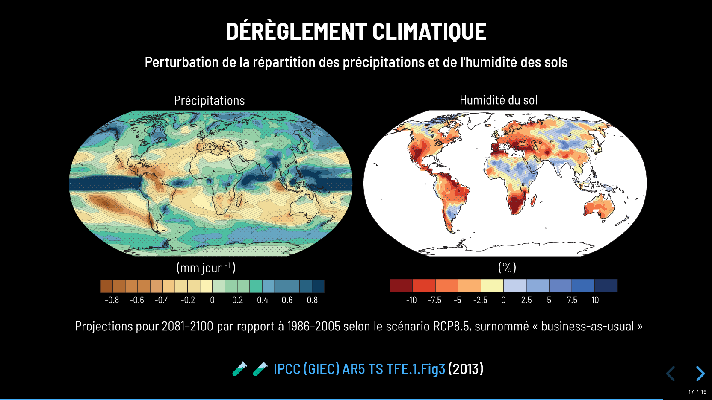
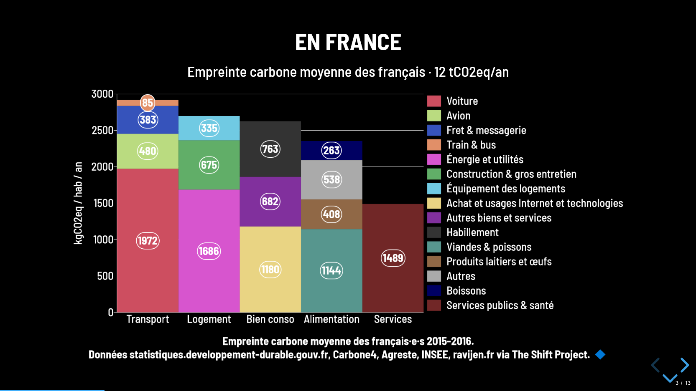

# **anthropocene** :earth_africa::factory:

Courses on ecology, energy and climate issues seen through a French prism.

This course is a synthesis of the important elements to know, from my point of view, about the crisis of the Anthropocene. The idea is to overview and link the key themes. The goal is not to see them in detail.


## **Instructions** :wrench::gear:

```
git clone https://github.com/ludchieng/anthropocene
npm install
npm start
```


## **Preview** :rocket::framed_picture:

Browse the Reveal.js slides with `←` `→`:




Data sources are given in subslides `↓`:




Chartjs pie and line charts:






White theme:




Texts, emojis and bullet points:







SVG images:






Chartjs bar graph:


